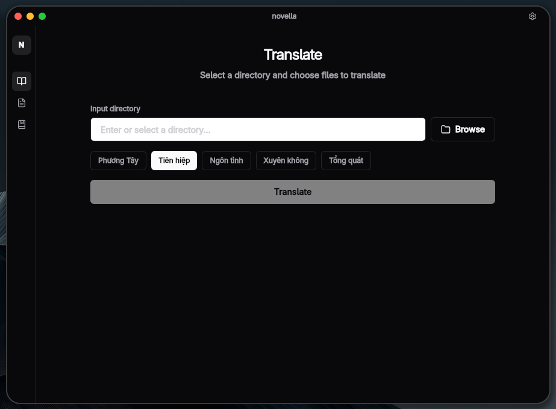

# novella

Translate novel with API LLMs



## Live Development

To run in live development mode, run `wails dev` in the project directory. This will run a Vite development server that will provide very fast hot reload of your frontend changes. If you want to develop in a browser and have access to your Go methods, there is also a dev server that runs on http://localhost:34115. Connect to this in your browser, and you can call your Go code from devtools.

## Building

To build a redistributable, production mode package, use `wails build`.

## Nix

Use `nix develop` to enter a shell that can run the app immediately.

```bash
nix develop
```

If you want the shell without auto-starting the app:

```bash
NOVELLA_NO_AUTORUN=1 nix develop
```

You can also launch the dev app directly:

```bash
nix run
```

Use the GitHub flake directly:

```bash
nix run github:mintori09/novella
nix profile install github:mintori09/novella
```

`nix run` starts the app from the remote flake. `nix profile install` installs the `novella` launcher into your profile.
